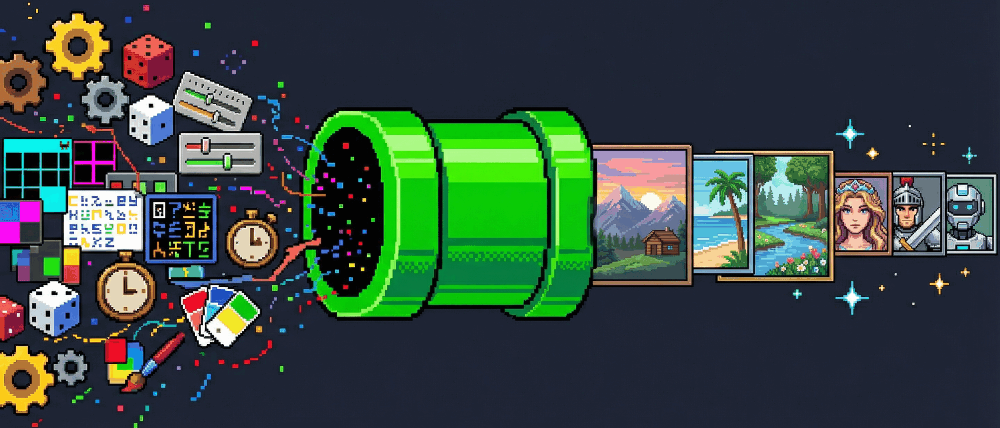
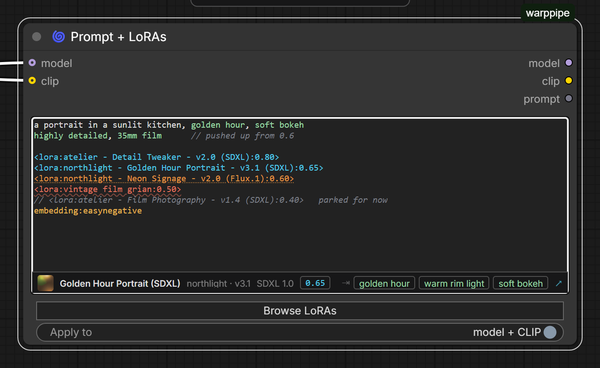
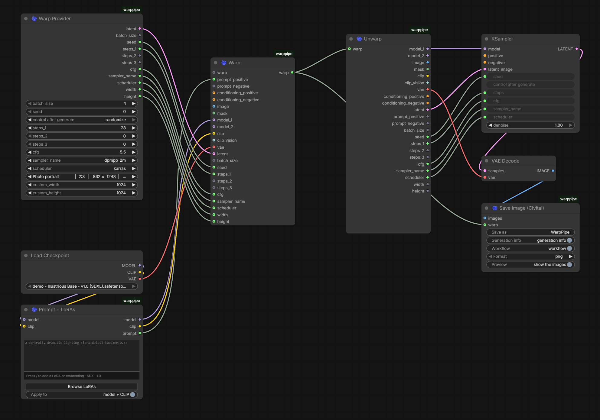
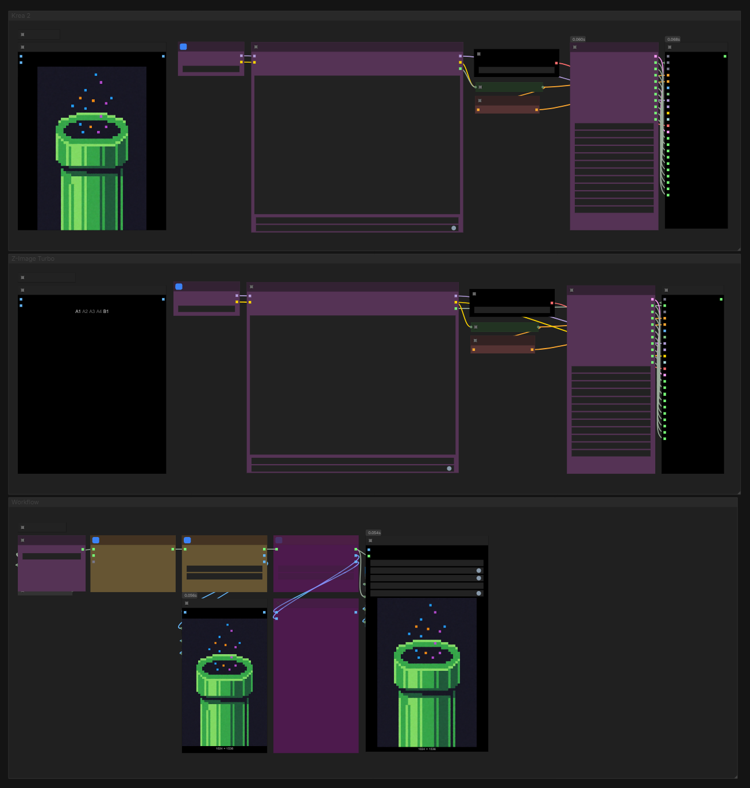

# WarpPipe

ComfyUI nodes that bundle a whole generation into one wire, and a prompt box
that keeps a prompt and its LoRAs in the same place.

- **Warp / Unwarp** — everything a sampler needs travels as a single link.
  Switching between whole model setups is one wire moved instead of twenty.
- **Prompt + LoRAs** — write `a portrait <lora:detail tweaker:0.8>` and have it
  mean it. The tags *are* the loader; the prompt is still a prompt.
- **Save Image (Civitai)** — writes metadata Civitai reads, so an upload
  credits the checkpoint and the LoRAs that actually made the picture.

They work apart as well as together.

## Install

```bash
comfy node install warppipe
```

Or clone into `ComfyUI/custom_nodes` and restart. Python 3.9+, no third-party
dependencies.

## The prompt box



Colour says what will happen before you run anything: cyan resolves, red matches
nothing, orange is built for another base model, green is a trigger word, grey
is a `//` note that never reaches the model. The line underneath describes
whichever tag the caret is in.

Press `/` to complete against your library inline, `Tab` to take it, `Tab` again
on a tag for that LoRA's trigger words. Weight, ordering and switching a LoRA off
are ordinary text edits, so undo covers all of them.

→ [Writing a prompt](WIKI.md#writing-a-prompt) ·
[the browser](WIKI.md#the-browser) · [all the keys](WIKI.md#keys)

## One wire



Everything on the left goes into a **Warp**. One link crosses the canvas. An
**Unwarp** gives it all back. Warps chain, so a second one downstream carries
everything the first did and adds to it.

→ [Bundling a generation](WIKI.md#bundling-a-generation)

## Works with Civitai Updater

WarpPipe reads the `.civitai.info` sidecars that
[Civitai Updater](https://github.com/gregory-richard/comfyui-civitai-updater)
writes: trigger words, base models, titles, Civitai links and the AutoV2 hash
Civitai matches on. Only the hash has a fallback — the rest simply are not there
without a sidecar, and the features built on them go quiet.

→ [What the sidecars give you](WIKI.md#what-the-sidecars-give-you)

## The nodes

| Node | |
| --- | --- |
| 🌀 **Warp** | Bundles models, conditioning, images, latents, prompts and parameters into one link |
| 🌀 **Unwarp** | Unpacks it into twenty-two outputs |
| 🌀 **Warp Provider** | Latent and parameters together, with 30+ resolution presets |
| 🌀 **Prompt + LoRAs** | The prompt box above |
| 🌀 **Save Image (Civitai)** | Saves with metadata Civitai reads |
| 🌀 **Scheduler Adapter for FaceDetailer** | Maps KSampler schedulers onto FaceDetailer's set |
| 🚫 **Dead End** | Accepts any type, produces nothing. Parks a branch without deleting it |

Every node carries its own help inside ComfyUI, behind the `?` on the node.

→ [Every input and output](WIKI.md#node-reference)

## Example workflow

Two model configurations — Krea 2 and Z-Image Turbo — each with its own Warp,
switched into one shared workflow:

<p align="center">
  
</p>

It produced this, and carries the workflow inside it — drag the image into
ComfyUI to open it:

<p align="center">
  
</p>

Save Image (Civitai) wrote this alongside it, which is what a site reads:

```
Steps: 8, Sampler: euler, Schedule type: simple, CFG scale: 1.0, Seed: 44,
Size: 1024x1536, Model hash: 8e4eeda70d, Model: krea2_turbo_int8_convrot,
Hashes: {"model":"8e4eeda70d"}, Version: ComfyUI-WarpPipe
```

Or download the [workflow JSON](examples/workflow_example.json).

## Documentation

Everything else is in **[WIKI.md](WIKI.md)**:
[getting started](WIKI.md#getting-started) ·
[usage](WIKI.md#usage) ·
[node reference](WIKI.md#node-reference) ·
[HTTP API](WIKI.md#http-api) ·
[architecture](WIKI.md#architecture) ·
[development](WIKI.md#development) ·
[troubleshooting](WIKI.md#troubleshooting)

## Credits

UI screenshots are taken from a real ComfyUI against a small demo LoRA folder;
those names are illustrative and that preview art is generated stand-in, not any
creator's work.

Developed with AI assistance (Claude Opus 5).

Licensed under the [MIT License](LICENSE).
