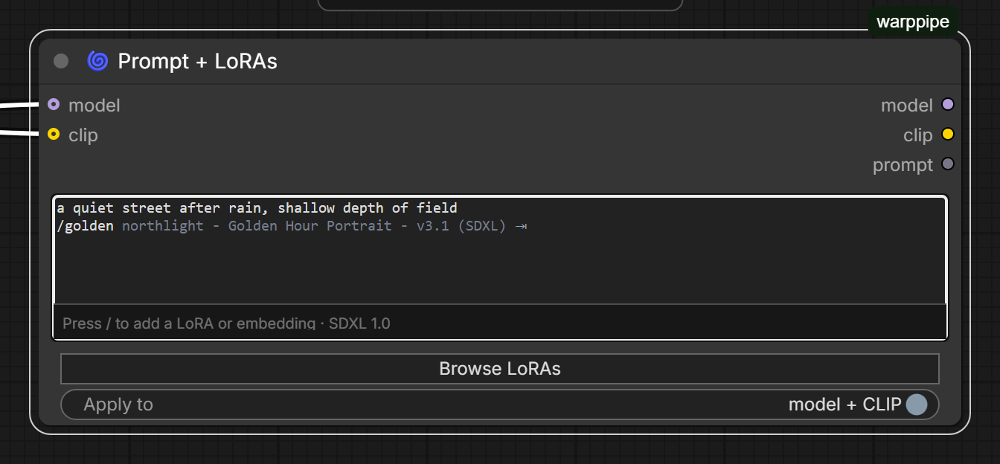
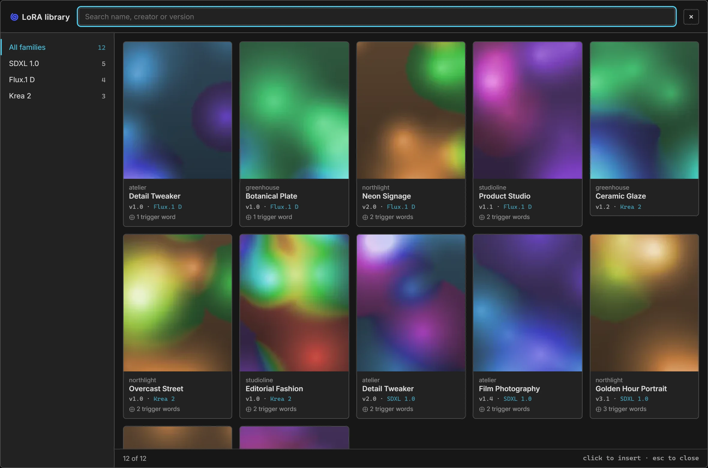
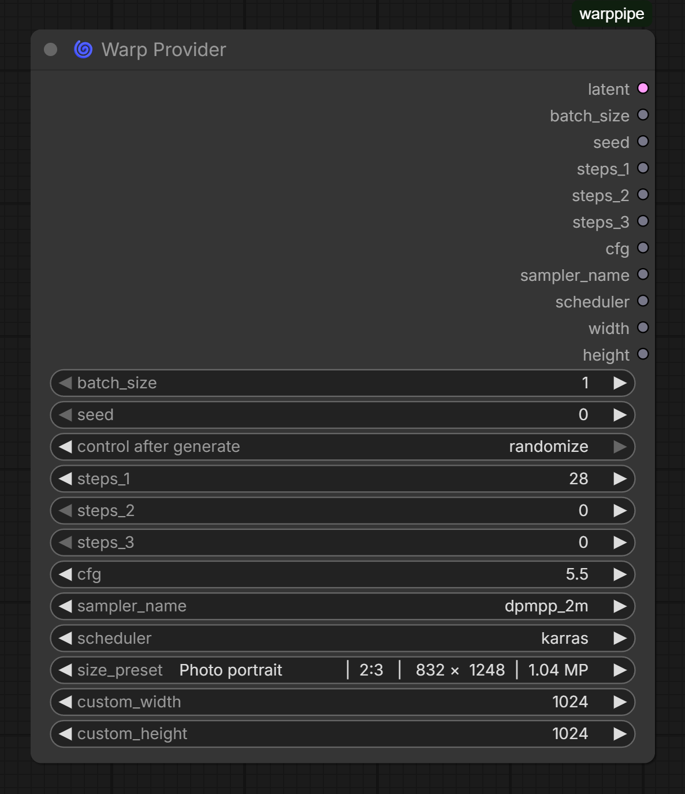
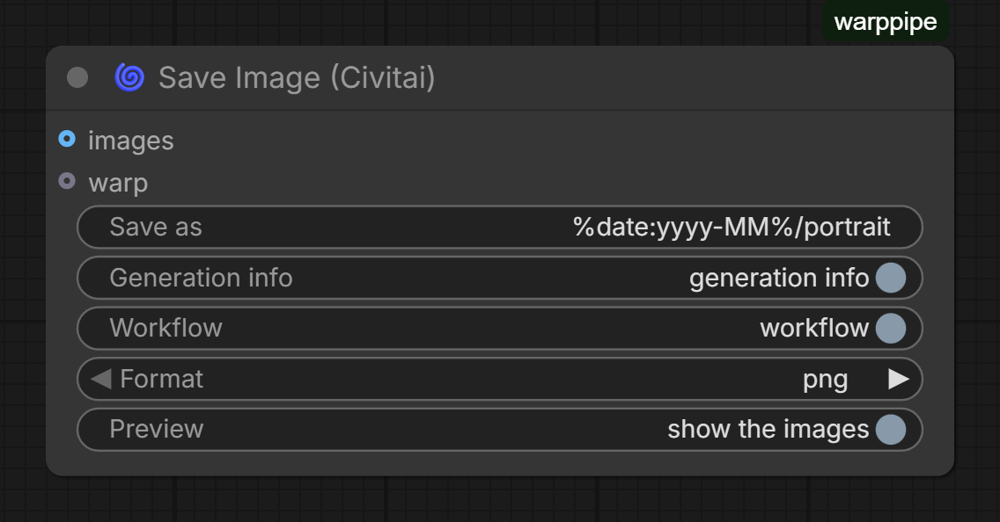

# WarpPipe documentation

Everything beyond the [README](README.md). Each node also carries its own help
inside ComfyUI, behind the `?` on the node.

- [Getting started](#getting-started)
- [Usage](#usage)
- [Node reference](#node-reference)
- [HTTP API](#http-api)
- [Architecture](#architecture)
- [Development](#development)
- [Troubleshooting](#troubleshooting)


---

## Getting started

Two things, in one node pack.

**A prompt box that owns its LoRAs.** Write `<lora:name:weight>` inline, the way
A1111 does, and the tags *are* the loader. The text is the only state: colouring,
completion, weights, ordering and switching a LoRA off are all edits to it.

**One wire instead of twenty.** A Warp bundles everything a generation needs;
an Unwarp gives it back. Whole model setups become a single connection you move.

Each node also carries its own help inside ComfyUI. The `?` on a node opens the
matching page from [`web/docs/`](web/docs) without leaving the canvas.

### Installing

From the ComfyUI Registry:

```bash
comfy node install warppipe
```

Or by hand, into `ComfyUI/custom_nodes`:

```bash
cd ComfyUI/custom_nodes
git clone https://github.com/gregory-richard/ComfyUI-WarpPipe.git
```

Restart ComfyUI afterwards either way. If you keep the source elsewhere, link it
in rather than copying — see [Development](#setting-up).

### What it needs

ComfyUI, Python 3.9 or newer, and nothing else. There are no third-party Python
dependencies: everything WarpPipe uses — `Pillow`, `aiohttp`, `torch` — already
ships with ComfyUI.

[Civitai Updater](https://github.com/gregory-richard/comfyui-civitai-updater) is
not required but is worth having; see
[Usage → What the sidecars give you](#what-the-sidecars-give-you).

### A quick tour

The shortest useful workflow is three nodes:

```
Load Checkpoint ──► Prompt + LoRAs ──► KSampler
                    (model, clip, prompt)
```

Type a prompt, press `/`, pick a LoRA, press `Tab`. The tag lands on a line of
its own and the LoRA is applied to the model and CLIP that come out.

The bundling is worth adding once a workflow has more than one model setup in
it:

```
Load Checkpoint ─┐
Warp Provider  ──┼──► Warp ────────► Unwarp ──► KSampler ──► VAE Decode
Prompt + LoRAs ──┘      │                                        │
                        └────────────────► Save Image (Civitai) ◄┘
```

The middle link carries the lot. Build a second Warp with a different checkpoint
and different steps, and switching between them is one connection moved.

### Version

This documents **4.0.0**. See the [changelog](CHANGELOG.md) for what changed,
and [Development](#development) for how releases are cut.

---

## Usage

### Writing a prompt

The **Prompt + LoRAs** node is a text box that understands what is in it.


LoRAs go inline, A1111 style:

```
a portrait in a sunlit kitchen, golden hour, soft bokeh
highly detailed, 35mm film      // pushed up from 0.6

<lora:atelier - Detail Tweaker - v2.0 (SDXL):0.80>
<lora:northlight - Golden Hour Portrait - v3.1 (SDXL):0.65>
// <lora:atelier - Film Photography - v1.4 (SDXL):0.40>   parked for now
```

The node's **model** and **clip** outputs come out patched with every tag it
resolved. Its **prompt** output is what you wrote with the tags and the notes
taken out — and nothing added.

#### What the colours mean

| | |
| --- | --- |
| cyan | a tag matching a file, built for the model you have connected |
| red, wavy underline | a tag matching nothing — check the spelling |
| orange, dotted underline | a real file, but built for another base model |
| amber | an embedding |
| green | a trigger word belonging to one of the LoRAs in use |
| grey italic | a note after `//`, which is not sent to the model |

Red and orange are different complaints. Red will not load at all. Orange loads
perfectly well and usually does nothing useful — you may know something the
sidecar does not. Hover either for the reason.

With nothing wired into **model**, or for a file whose sidecar declares no base,
nothing can be judged and nothing goes orange.

#### Naming a LoRA

A tag does not need the full filename, only enough to identify one file.
Matching is tried in this order, ignoring case and slash direction:

1. the full name — `sdxl/atelier - Detail Tweaker - v2.0 (SDXL).safetensors`
2. the filename without folder or extension — `atelier - Detail Tweaker - v2.0 (SDXL)`
3. every word, in any order — `sdxl detail tweaker` finds the above
4. a unique fragment — `detail tweaker`

Option 2 always works and is what the browser inserts. Option 3 is usually the
shortest thing worth typing.

**A tag that matches nothing, or matches several files, stops the run** and says
what it matched. That is deliberate: generating without a LoRA the prompt asked
for gives a wrong picture *and* wrong metadata, and a console warning is too easy
to miss. A near miss suggests the closest names, so a typo is a question rather
than a dead end.

#### Completing with `/`



The suggestion is drawn in grey rather than shown in a popover, so it never
covers what you are typing, and it is filtered to the base model you have wired
in. `Tab` takes it. Taking a LoRA that declares trigger words offers them
straight away as a second suggestion, so the common pair — add it, then say its
word — is `Tab` twice and no dialog.

Nothing is written into the box until you accept. The suggestion cannot be typed
over, cannot land in the undo history, and does not mark the workflow changed
while you are only looking.

#### Keys

| | |
| --- | --- |
| `/` | complete against the library, inline |
| `Tab` | take the suggestion; on an existing tag, offer that LoRA's trigger words |
| `↑` `↓` | walk the alternatives while a suggestion is showing |
| `Ctrl+↑` `Ctrl+↓` | change the weight of the tag the caret is in, in steps of 0.1 |
| `Ctrl+/` | comment the line out, which switches that LoRA off |
| `Alt+↑` `Alt+↓` | move the line, which reorders when LoRAs are applied |
| `Esc` | drop the suggestion |

Each of these is an ordinary edit to the text, which is why a tag gets a line to
itself. It also means the browser's own undo understands all of them.

#### Trigger words

Nothing is added to your prompt. `Tab` on a tag offers that LoRA's words, and
the strip lists the first six as buttons; either way you pick, and they land on a
line of their own as ordinary prompt text.

That is the point of choosing. Appending them silently would send words you never
saw, and creators do not always put a keyword in `trainedWords` — in one real
collection the longest entry ran to 655 characters.

#### The browser

**Browse LoRAs** opens the library as cards.



The rail groups by family with counts. The family of the model you have
connected is pinned and marked; the rest stay visible but dimmed, because you
may have a reason. Search matches creator, name, version and family. Clicking a
card writes its tag where the caret was.

### Bundling a generation


Connect anything you like into a **Warp** — models, CLIP, VAE, conditioning,
images, masks, latents, prompts, and the sampling parameters. One `WARPPIPE`
link carries all of it. An **Unwarp** unpacks it into twenty-two outputs in a
fixed order.

Two things worth knowing:

- **Warps chain.** Give a Warp another warp on its `warp` input and it starts
  from that one's contents, then applies whatever else is connected. Build a
  base warp and extend it per branch.
- **Absent is not default.** A field nothing was connected to comes back as
  `None`, not as an invented `euler` or `512`. If a downstream node needs a
  value, connect one.

The intended shape is one Warp per model or style — each with its own steps,
CFG, sampler, scheduler and resolution — and switching between them by moving
the single link into your Unwarp.

#### Parameters and latents

**Warp Provider** is the other half: one node holding the seed, steps, CFG,
sampler, scheduler and size, and producing the empty latent to match.



Thirty-odd presets cover every common aspect ratio from 9:16 to 16:9, each
labelled with its use, ratio, pixel size and megapixels, sorted by ratio and
then by size. Pick `Custom` to use the `custom_width` and `custom_height` boxes.

The latent it makes is the SD1.5/SDXL shape — four channels at an eighth scale,
the same as ComfyUI's own Empty Latent Image. Architectures on a wider latent
(Flux, SD3) need their own empty-latent node; the presets here are SDXL's
anyway.

### Saving for Civitai



Civitai identifies a checkpoint or a LoRA by a hash of the file, not by its
name, and reads those hashes out of an A1111-style `parameters` text chunk.
**Save Image (Civitai)** writes that chunk alongside ComfyUI's own, so one PNG
both satisfies the site and still reopens as a workflow.

Connect your images, and a warp carrying the prompt, seed, steps, CFG and
sampler. The resources are worked out from the graph:

- It walks back from itself, so only nodes that actually fed this image count.
  A branch behind a switch that did not run is not credited.
- With several checkpoints upstream, the nearest one wins — a refiner in front
  of a base is the one recorded.
- LoRAs are found in ComfyUI's own loaders, in numbered stacker slots, in
  rgthree-style slot dicts, and as `<lora:...>` tags in any text input. A tag
  behind a `//` is skipped, because it never loaded.
- A LoRA the workflow names but which is not on disk is left out and logged,
  rather than credited to a picture it never touched.

#### The toggles

| | |
| --- | --- |
| **Save as** | `filename_prefix`. Understands `%date:yy-MM-dd hh-mm-ss%` as well as ComfyUI's `%width%`/`%height%`. A slash makes a subfolder. |
| **Generation info** | The `parameters` block: prompt, seed, sampler, size, model and LoRA hashes. |
| **Workflow** | The whole ComfyUI graph, so the image can be dragged back in — which also reveals your pipeline to anyone you send it to. PNG only. |
| **Format** | `png` is lossless and holds the workflow; `jpeg` is much smaller and keeps the generation info in EXIF, which Civitai also reads. |
| **Preview** | Whether the saved images appear on the node. They are saved either way. |

`%date:...%` is expanded here rather than in the frontend, so a prompt sent over
the API behaves the same as one run from the browser.

Choosing JPEG with **Workflow** on saves the file and tells you the workflow was
dropped, rather than silently omitting it.

### What the sidecars give you

WarpPipe reads `.civitai.info` files sitting beside your models — the sidecars
[Civitai Updater](https://github.com/gregory-richard/comfyui-civitai-updater)
writes and keeps current.

| Field | Used for | Without it |
| --- | --- | --- |
| `trainedWords` | trigger words: `Tab`, the strip, green colouring | no trigger words at all |
| `baseModel` | family grouping, the orange warning, filtering `/` | grouped by folder instead |
| `model.name` | the real model name on cards and in the strip | the filename |
| `modelId`, `id` | the ↗ link to its page on Civitai | no link |
| `files[].hashes.SHA256` | the AutoV2 hash Civitai matches on | computed by hashing the file, then cached |

Only the hash has a fallback. Everything else is simply absent, and the features
built on it go quiet — the LoRA still lists, still previews and still applies.

Preview images are read straight off the disk: any `.preview.png`, `.preview.jpg`
or bare `.png` next to the model file. They are cached down to 320px WebP
thumbnails on first request, because full previews are generations in their own
right — around 1.27 MB each in a real collection, against 6–9 KB cached.

Links point at `civitai.red` rather than `civitai.com`. Since the April 2026
split, `.com` serves an SFW-filtered catalogue, so a link to it for a mature
model arrives nowhere useful; `.red` serves everything, checked against a model
flagged safe.

---

## Node reference

Seven nodes, all under **Custom/WarpPipe Nodes**. Node IDs are what saved
workflows and the API use; display names are what you see on the canvas.

| ID | Display name |
| --- | --- |
| `Warp` | 🌀 Warp |
| `Unwarp` | 🌀 Unwarp |
| `Warp Provider` | 🌀 Warp Provider |
| `Warp Lora Prompt` | 🌀 Prompt + LoRAs |
| `Save Image Civitai` | 🌀 Save Image (Civitai) |
| `FD Scheduler Adapter` | 🌀 Scheduler Adapter for FaceDetailer |
| `Dead End` | 🚫 Dead End |

---

### 🌀 Warp

Bundles data into a single `WARPPIPE` object.

**Inputs** — all optional.

| Input | Type | Notes |
| --- | --- | --- |
| `warp` | `WARPPIPE` | Start from another warp's contents, then add to them |
| `model_1`, `model_2` | `MODEL` | |
| `clip` | `CLIP` | |
| `clip_vision` | `CLIP_VISION` | |
| `vae` | `VAE` | |
| `conditioning_positive`, `conditioning_negative` | `CONDITIONING` | |
| `image` | `IMAGE` | |
| `mask` | `MASK` | |
| `latent` | `LATENT` | |
| `prompt_positive`, `prompt_negative` | `STRING` | link only |
| `batch_size`, `seed`, `steps_1`, `steps_2`, `steps_3`, `width`, `height` | `INT` | link only |
| `cfg` | `FLOAT` | link only |
| `sampler_name` | sampler enum | link only |
| `scheduler` | scheduler enum | link only |

**Output:** `warp` — `WARPPIPE`.

Three step counts exist because multi-pass workflows want them: a base pass, a
refiner, a detailer. Nothing forces you to use more than `steps_1`.

Sampler and scheduler are coerced on the way in. A name ComfyUI does not know
becomes `euler` or `karras` rather than travelling as something a sampler will
later reject. Linked enums from other node packs are accepted — see
[Architecture → Validation](#validation).

---

### 🌀 Unwarp

Unpacks a warp. Its one input, `warp`, is optional; with nothing connected every
output is `None`.

**Outputs**, in order:

`model_1`, `model_2`, `image`, `mask`, `clip`, `clip_vision`, `vae`,
`conditioning_positive`, `conditioning_negative`, `latent`, `prompt_positive`,
`prompt_negative`, `batch_size`, `seed`, `steps_1`, `steps_2`, `steps_3`, `cfg`,
`sampler_name`, `scheduler`, `width`, `height`.

A field the warp never carried comes back as `None`, not as a default. Inventing
`euler` for a sampler nobody set would produce an image with the wrong settings
and no indication that anything was missing.

---

### 🌀 Warp Provider

Sampling parameters and a matching empty latent, in one node.

| Input | Type | Default | Range |
| --- | --- | --- | --- |
| `batch_size` | `INT` | 1 | 1–64 |
| `seed` | `INT` | 0 | 0–2⁶⁴−1 |
| `steps_1` | `INT` | 20 | 1–200 |
| `steps_2`, `steps_3` | `INT` | 0 | 0–200 |
| `cfg` | `FLOAT` | 7.0 | 0.0–50.0 |
| `sampler_name` | sampler enum | `euler` | |
| `scheduler` | scheduler enum | `normal` | |
| `size_preset` | 31 presets | Square (SDXL native) 1024×1024 | |
| `custom_width`, `custom_height` | `INT` | 1024 | 64–8192, step 8 |

**Outputs:** `latent`, `batch_size`, `seed`, `steps_1`, `steps_2`, `steps_3`,
`cfg`, `sampler_name`, `scheduler`, `width`, `height`.

Presets are labelled `use case | ratio | width × height | megapixels` and sorted
by aspect ratio (9:16 up to 16:9), then by size. Every one is divisible by 8
with the short side at most 2048. Choose `Custom` to use the two custom boxes.

The latent is four channels at an eighth scale — the SD1.5/SDXL shape, matching
ComfyUI's own Empty Latent Image. Wider-latent architectures need their own
node.

Dimensions are validated before the tensor is made: a linked width that is not
an integer, is out of range, or is not divisible by 8 raises rather than
producing a latent nothing can sample.

---

### 🌀 Prompt + LoRAs

The prompt and its LoRAs in one text box. Full walkthrough in
[Usage → Writing a prompt](#writing-a-prompt).

| Input | Type | Notes |
| --- | --- | --- |
| `text` | `STRING` | multiline. The prompt, with `<lora:name:weight>` tags inline and `//` notes |
| `apply_to_clip` | `BOOLEAN` | default on. Patch the text encoder as well as the model |
| `model` | `MODEL` | optional |
| `clip` | `CLIP` | optional |

**Outputs:** `model`, `clip`, `prompt`.

`prompt` is what you wrote with tags and notes removed and nothing added. Blank
lines you wrote are kept — at most one in a row — but a line that held only a
tag or only a note is removed rather than left behind as a blank.

**`apply_to_clip`** decides whether the text encoder is patched too. Whether it
matters depends entirely on the LoRA: in a survey of 761 files, every Krea2,
Flux2, Wan, Qwen, ZIT and LTX LoRA was model-only, so patching CLIP changed
nothing; among SDXL LoRAs, 76% carried text-encoder weights, where turning it off
discards half of what the LoRA does. Leave it on unless you have a reason.

Encode the prompt **after** the LoRAs are applied — take this node's `clip`
output into your text encoder, not the CLIP straight from the loader.

There is also a hidden `loras` input, kept so workflows saved before the tags
moved into the prompt still load. The strip offers to move its contents into the
prompt; nothing writes to it any more.

---

### 🌀 Save Image (Civitai)

Saves images with metadata Civitai reads. Details in
[Usage → Saving for Civitai](#saving-for-civitai).

| Input | Type | Default | Shown as |
| --- | --- | --- | --- |
| `filename_prefix` | `STRING` | `WarpPipe` | Save as |
| `embed_metadata` | `BOOLEAN` | on | Generation info |
| `embed_workflow` | `BOOLEAN` | on | Workflow |
| `file_format` | `png` / `jpeg` | `png` | Format |
| `preview` | `BOOLEAN` | on | Preview |
| `images` | `IMAGE` | — | optional |
| `warp` | `WARPPIPE` | — | optional |

Hidden inputs: `prompt`, `extra_pnginfo`, `unique_id`. No outputs — this is an
output node.

`images` is optional on purpose: bypassing an upstream branch leaves this node
idle instead of failing the whole prompt. When nothing arrives it saves nothing
and says so, on the node and in the log, rather than reporting a silent success.

---

### 🌀 Scheduler Adapter for FaceDetailer

**Input:** `scheduler` — a KSampler scheduler (required).
**Output:** `scheduler` — one FaceDetailer accepts.

FaceDetailer builds its list as ComfyUI's schedulers plus Impact Pack's own.
Exotic entries — `AYS SDXL`, `GITS[coeff=1.2]`, `OSS FLUX` and friends — pass
through when the target list has them and are mapped to `karras` when it does
not.

---

### 🚫 Dead End

**Input:** `input` — any type, optional. **No outputs.**

It is not an output node, so ComfyUI never executes it, which is the point: it
terminates a branch without running it. Useful for parking a path while you work
on another, or for tidying an unused output.

---

### Registration

Both registration paths are built from one table in `warp_pipe.py`, so every
node exists whichever path runs.

- **Legacy** (default) — `NODE_CLASS_MAPPINGS` and `NODE_DISPLAY_NAME_MAPPINGS`.
- **V3** — set `WARPPIPE_ENABLE_V3=1` to register through
  `comfy_entrypoint()` and ComfyUI's V3 schema instead.

The two are mutually exclusive; the package exports one or the other, never
both. If a node were ever added without a V3 schema, startup logs an error
naming it rather than quietly dropping it.

---

## HTTP API

Four routes, registered on ComfyUI's own `PromptServer` at import. They exist
for WarpPipe's frontend; nothing stops you calling them yourself.

If `aiohttp` or `server` cannot be imported — running the module outside
ComfyUI, for tests or a lint — registration is skipped and the nodes still work.
The frontend degrades with it: tags go uncoloured and the browser says the
library is unavailable.

```
GET /warppipe/loras
GET /warppipe/embeddings
GET /warppipe/model/base?name=<name>
GET /warppipe/lora/thumbnail?name=<name>&kind=<loras|embeddings>[&full=1]
```

---

### `GET /warppipe/loras`

Every LoRA in the configured folders, with everything the browser needs and no
image data.

```json
{
  "loras": [
    {
      "id": "sdxl/atelier - Detail Tweaker - v2.0 (SDXL).safetensors",
      "folder": "sdxl",
      "creator": "atelier",
      "name": "Detail Tweaker",
      "version": "v2.0",
      "tagged_base": "SDXL",
      "base_model": "SDXL 1.0",
      "structured": true,
      "title": "Detail Tweaker (SDXL)",
      "url": "https://civitai.red/models/58390?modelVersionId=583901",
      "triggers": ["highly detailed", "intricate detail"],
      "has_preview": true,
      "kind": "loras",
      "thumbnail": "/warppipe/lora/thumbnail?name=sdxl%2F...&kind=loras"
    }
  ]
}
```

| Field | Where it comes from |
| --- | --- |
| `id` | the exact string a `<lora:...>` tag has to resolve to. Uses the platform's separator, so a Windows entry reads `sdxl\name.safetensors`; tag matching ignores slash direction either way |
| `folder` | the first path segment inside the LoRA folder |
| `creator`, `name`, `version`, `tagged_base` | parsed from a `creator - name - version (base)` filename |
| `structured` | whether the filename actually had that shape — when false, `name` is the whole stem and callers should not pretend otherwise |
| `base_model` | the sidecar's `baseModel`, tidied |
| `title` | the sidecar's `model.name` |
| `url` | built from the sidecar's `modelId` and `id` |
| `triggers` | the sidecar's `trainedWords`, split on commas |
| `has_preview`, `thumbnail` | whether an image sits beside the file; the server owns URL construction |

Sidecar-derived fields are `null` or empty when there is no `.civitai.info`.

Cost is one directory listing, one sidecar read and a handful of `stat` calls
per model. Against 761 files it answers in well under a second and returns a few
hundred kilobytes of JSON.

---

### `GET /warppipe/embeddings`

Identical, keyed `embeddings`. Every entry carries `"kind": "embeddings"`, which
is how the frontend knows to insert `embedding:name` rather than a `<lora:>`
tag.

---

### `GET /warppipe/model/base`

The base model of one file, for matching LoRAs against the checkpoint that is
wired in.

```
GET /warppipe/model/base?name=demo%20-%20Illustrious%20Base%20-%20v1.0%20(SDXL).safetensors
```

```json
{ "name": "...", "base_model": "SDXL 1.0", "found": true }
```

Looked up across `loras`, `checkpoints`, `diffusion_models`, `unet` and
`embeddings`. `found` is whether the file resolved at all; `base_model` is
`null` when it did but declares nothing.

---

### `GET /warppipe/lora/thumbnail`

The preview image beside a model.

| Parameter | |
| --- | --- |
| `name` | the model's `id` from the index |
| `kind` | `loras` or `embeddings`; anything else is a 400 |
| `full` | `1` to serve the original instead of the thumbnail |

Without `full`, a WebP capped at 320px on the long side, built on first request
and cached by path, size and mtime — so replacing a preview refreshes it.
Measured against a real collection: previews average 1.27 MB, thumbnails 6–9 KB,
about 20 ms to build and under a millisecond to serve after that. Both are sent
with `Cache-Control: max-age=86400`.

404 when the model has no preview beside it, or when a thumbnail cannot be built
(no Pillow, or nowhere writable to cache it).

#### On paths

`name` is resolved through ComfyUI's `folder_paths`, which is what keeps this to
configured model folders — an arbitrary path can never be requested, and `..`
is neutralised before the lookup. The route serves preview images beside
configured models and nothing else.

These routes are unauthenticated, exactly as the rest of ComfyUI's are. Anyone
who can reach your ComfyUI can list your model library through them, which is
worth knowing if you have bound the server to something other than localhost.

---

## Architecture

```
warp_pipe.py          every node, the storage, the resource scan, the routes
__init__.py           picks a registration path and re-exports it
web/
  prompt_ui.js        the coloured prompt box, the strip, inline completion
  lora_browser.js     the library modal
  model_base.js       which base model a node is wired to
  library.js          one fetch of the index, shared by both views
  text.js             escaping and filename helpers
  widget_values.js    saving widget values by name rather than by position
  save_image_ui.js    friendly labels, and the toast when nothing was saved
  docs/*.md           the per-node help ComfyUI shows behind the ? button
WIKI.md               this documentation
tests/                pytest, no ComfyUI required
```

### How a warp travels

A `WARPPIPE` link does not carry the data. It carries `{"id": "<uuid>"}`, and
the data sits in a module-level dict keyed by that id.

That is a deliberate trade. Passing tensors and model patchers down a link would
have ComfyUI copy and cache them at every hop; passing a token means a Warp
costs the same whether it carries a seed or six models.

The cost is that the dict holds references, so a stored bundle keeps its models
alive. Two limits bound it: entries older than an hour are pruned, and no more
than 256 are kept, oldest evicted first. An Unwarp refreshes an entry's
timestamp when it reads it, so a warp in active use never expires. All of it is
under one lock, and the cleanup runs on insertion rather than on a timer.

Each `Warp` instance gets its id at construction. ComfyUI caches node instances
per graph node, so the id is stable across runs of the same workflow.

### Validation

Sampler and scheduler sockets are the awkward part of this pack.

ComfyUI types a combo socket by its list of options, so a `sampler_name` coming
out of another node pack with a wider list is a *different type* to ComfyUI's
own, and the link is refused. WarpPipe wants those links to work.

Earlier versions patched ComfyUI's global prompt validator, which affected every
node in the process. That is gone. Instead each node declares
`VALIDATE_INPUTS(input_types)`, which:

- keeps normal socket checks for everything else — an `IMAGE` into a `MODEL`
  still fails, and says so;
- relaxes only `sampler_name` and `scheduler`;
- accepts a comma-joined enum string that shares any member with what was
  expected, which is how some builds spell a combo type.

Whatever arrives is then coerced at run time: an unknown sampler becomes
`euler`, an unknown scheduler `karras`. The allowlists are snapshots of
ComfyUI's lists taken at import, not references to them — a reference would grow
as other packs registered their own schedulers, and coercion would stop
coercing.

### Finding the resources for a saved image

`Save Image (Civitai)` needs to know which checkpoint and which LoRAs made the
picture. It reads the prompt graph ComfyUI passes it as a hidden input.

1. **Walk back from this node.** Breadth-first over the links, recording how far
   each node is. Nodes not upstream are ignored, so a second branch of a large
   workflow contributes nothing.
2. **Follow only the taken branch of a switch.** A switch names its inputs
   `input1..inputN` and carries a `select`; the others are wired but never ran.
   The selector is usually a small constant node one link away, so that is
   followed too — but only when it is unambiguous. When the choice cannot be
   read, every branch is followed, as before, because dropping a real resource
   is worse than including a spare one.
3. **Recognise loaders by the input they carry**, not by class name — `ckpt_name`,
   `unet_name`, `model_name`. A name that resolves inside the checkpoint,
   diffusion-model or UNet folders is a model whatever the input is called, so a
   loader from an unknown pack still records what it loaded.
4. **Collect LoRAs** from `lora_name`, from numbered `lora_name_1` slots with
   their matching strengths, from rgthree-style `{"lora":…, "on":…}` dicts
   honouring the on/off switch, and from `<lora:...>` tags in any string input
   with comments stripped first.
5. **Nearest model wins.** With several upstream, the one fewest links away is
   the one that made this picture — a refiner in front of a base. Equal
   distances fall to the order the graph listed them.

Then each name is resolved to a file and hashed. A name that resolves to nothing
is logged and left out: crediting a LoRA that was never applied describes an
image that was not made.

### Hashes and metadata

Civitai matches a resource by AutoV2 — the first ten hex characters of the
file's SHA256. WarpPipe takes it from the sidecar when one is there and hashes
the file when it is not, caching by path, size and mtime so a replaced file
re-hashes and an unchanged one never does.

Two conventions go into the `parameters` block, because they are read by
different things:

- `Lora hashes: "name: hash"` — A1111's additional-networks spelling.
- `Hashes: {"model": …, "lora:name": …}` — what Civitai's own extension writes,
  and the field it actually links resources from.

Writing only the first is why an upload would name its checkpoint and credit
none of its LoRAs: the checkpoint comes from `Model hash`, which both agree on,
and the LoRAs were never anywhere Civitai looked.

JPEG has no text chunks, so for that format the same block goes into EXIF
`UserComment` as UTF-16BE behind a `UNICODE\0` marker — what A1111 writes and
what every reader of these files expects.

### The prompt box

The text is the only state. There is no list of LoRAs kept beside it, because two
sources of truth disagree eventually.

A transparent `textarea` sits over a highlight layer that renders the same
string as coloured spans. Every property that decides where a glyph lands is
copied from one to the other, including the width ComfyUI's scrollbar gutter
takes, or the colouring slides off the words. Typing, selection, undo and IME
are all the real textarea's.

Suggestions are *drawn* on that layer rather than written into the value.
Writing them meant undoing them on every keystroke, which raced with fast typing,
filled the undo stack with edits nobody made, and marked the workflow dirty
while merely browsing.

Edits go through `document.execCommand("insertText")` — the only way to change a
textarea that the browser's own undo still understands. Assigning to `value`
clears the undo stack, which would make every weight nudge a point of no return.

Layout is watched on a 100ms timer rather than with a `ResizeObserver`, which
only delivers while the page renders: a node resized in a background tab came
back with the layer at its old size. The timer, the observer and the strip are
all torn down on `onRemoved`.

### Widget values

ComfyUI serialises widget values positionally. Anything that changes widget
order between a save and a load — an extension reordering them, or a widget
added in a later version — shifts every later value onto the wrong widget,
silently. Booleans are the worst of it, because the wrong value is still valid.

This pack reorders its own widgets, so it also writes them by name into the saved
workflow and reads them back by name. A workflow saved before that existed falls
back to a per-node migration that knows what the old shape meant.

### Registration

`NODE_DEFINITIONS` maps node id to display name and class, and both registration
paths are built from it. Keeping two lists in step by hand is exactly how V3 mode
once shipped five of the seven nodes, with nothing said about the other two.

The V3 implementation is opt-in behind `WARPPIPE_ENABLE_V3=1` while the upstream
API settles. A test asserts both paths cover the same set.

### Compatibility shims

`comfy.samplers` is imported behind a `try`, with a small mock behind it, so the
module imports outside ComfyUI for tests and lint. The mock exists only to make
import work; it is not a simulation of ComfyUI.

`beta57` and `bong_tangent` are registered globally against the karras handler so
other packs accept a workflow built around RES4LYF's schedulers even when
RES4LYF has not loaded. Startup logs which names it stood in for.

---

## Development

### Setting up

Clone anywhere and link it into ComfyUI rather than working inside
`custom_nodes`:

```powershell
$src = "C:\path\to\ComfyUI-WarpPipe"
$dst = "C:\path\to\ComfyUI\custom_nodes\warppipe"
New-Item -ItemType Junction -Path $dst -Target $src
```

```bash
ln -s /path/to/ComfyUI-WarpPipe /path/to/ComfyUI/custom_nodes/warppipe
```

### Checks

Everything CI runs, in the order it runs it:

```bash
python -m ruff check . --exclude .agents --exclude .claude
```

```bash
python -m ruff format --check . --exclude .agents --exclude .claude
```

```bash
python -m pytest -q
```

```bash
npm ci && npm run check
```

The Python tools are pinned in the workflow and the frontend lockfile is
committed, both for the same reason: a build going red should mean the code
changed, not that a tool released that morning.

`npm run check` is eslint plus prettier over `web/`. `npm run format` writes the
formatting rather than checking it.

### Tests

`pytest` needs no ComfyUI. `tests/conftest.py` installs a fake `comfy`,
`comfy_api` and `torch` into `sys.modules` and loads `warp_pipe.py` fresh for
each test, so legacy and V3 registration can both be exercised in one run.

The fakes exist to make import work and to let schemas be inspected. They are
not a simulation of ComfyUI: anything depending on real execution semantics has
to be tried in ComfyUI.

Worth knowing when adding tests:

- `warp_pipe` and `package_loader` fixtures give you a freshly imported module;
  `warp_pipe_loader(enable_v3=True)` gives you the V3 path.
- A test that asserts a fix should be checked against the unfixed code once, by
  reverting the change and watching it go red. A regression test that never
  could have failed is decoration.
- `test_the_package_ships_every_file_the_frontend_needs` reads `pyproject.toml`
  and asserts every file under `web/` is matched by a `package-data` glob. Add a
  `.css` there and it will tell you before the wheel does.

### Adding a node

1. Write the class in `warp_pipe.py` with `INPUT_TYPES`, `RETURN_TYPES`,
   `RETURN_NAMES`, `FUNCTION` and `CATEGORY`.
2. Add it to `NODE_DEFINITIONS`. That is what both registration paths are built
   from, so this is the only list.
3. Add a V3 class and an entry in `V3_NODE_CLASSES`. Startup logs an error
   naming anything in `NODE_DEFINITIONS` without one, and a test fails.
4. Write `web/docs/<Node ID>.md`. ComfyUI shows it behind the `?` on the node.
5. Document it under [Node reference](#node-reference) and, if it is worth
   showing, in the README.

V3 schemas share one field-id namespace across inputs and outputs, so an output
mirroring an input needs a distinct id and a matching `display_name` — `model`
in, `model_out` displayed as `model` out.

### Screenshots

`assets/docs/*.webp` are captured from a real ComfyUI, not mocked. The setup:

1. Build a small demo LoRA folder — plausible filenames in the
   `creator - name - version (base)` convention, `.civitai.info` sidecars, and
   generated stand-in preview art. Never the real library; a public README
   should not carry somebody's model collection.
2. Run a second ComfyUI on another port with `--base-directory` pointed at that
   folder, so the running instance is untouched. `--base-directory` does not
   override `extra_model_paths.yaml`, so copy `main.py` and the other loose
   modules into a scratch directory beside junctions to the package directories;
   ComfyUI then looks for the config next to that copy and finds none.
3. Drive it with Playwright against an installed Chrome, at
   `deviceScaleFactor: 2`, hiding `.workflow-tabs-container`,
   `.side-toolbar-container`, `.subgraph-breadcrumb` and `.actionbar-container`
   so the app's own chrome stays out of the clip.

Save flat UI shots as lossless WebP and anything with real gradients as quality
90. Palette-quantised PNG bands badly on preview art.

### Releasing

1. Move the `[Unreleased]` block in `CHANGELOG.md` under a new version heading
   with today's date.
2. Set the version in **both** `pyproject.toml` and `version.txt`.
3. Merge to `main`.

The publish workflow fires on a push touching `pyproject.toml`, but only
publishes when the version there actually changed against the previous commit —
editing lint config does not re-publish. A manual `workflow_dispatch` always
publishes.

Semver as this project reads it: a new node or a new capability is a minor; a
change that makes an existing workflow load differently is a major. 3.0.0 was
the `CONTROL` → `WARPPIPE` rename. 4.0.0 is the prompt box and the Civitai save
node — nothing breaks, but it is a different pack to use.

### Registry metadata

`[tool.comfy]` in `pyproject.toml` carries the publisher, display name, and raw
GitHub URLs for `assets/registry/icon.png` and `assets/registry/banner.png`.
Those two are the sized, quantised copies — the originals live in
`assets/source/` and are far too heavy for a listing page.

---

## Troubleshooting

### The nodes do not appear

Restart ComfyUI after installing, then check the startup log. WarpPipe logs
`WarpPipe LoRA library routes registered` when it has loaded; an import failure
appears above that as a traceback naming the file.

If you installed by hand, the folder has to be directly inside `custom_nodes`,
with `__init__.py` at its top level.

### Some nodes are missing, but not all

If `WARPPIPE_ENABLE_V3` is set in your environment, WarpPipe registers through
ComfyUI's V3 API. Should a node ever lack a V3 schema, startup logs an error
naming it. Unset the variable to fall back to the legacy path, which registers
everything.

### The prompt box is a plain text field

No colouring, no strip, no `/` completion means the frontend did not load. Check
the browser console for a failed import of `/extensions/warppipe/prompt_ui.js`.

If you installed from the registry with a version before 4.0.0, the wheel did
not ship the JavaScript at all — `package-data` listed only the documentation.
Upgrading fixes it.

### Every tag is red

Red means no file matched. If *every* tag is red, the library did not load
rather than every name being wrong. Open `/warppipe/loras` directly:

```
http://127.0.0.1:8188/warppipe/loras
```

An error or an empty list points at ComfyUI's LoRA folder configuration, not at
your prompt.

### A tag is red but the file is there

The name has to identify exactly one file. Try, in order: the filename without
folder or extension, then several words from it in any order. A bare fragment
that matches several files cannot be resolved — in one real collection, 24 files
share a single common phrase.

A near miss suggests the closest names in the message, which usually settles it.

### The run stops with "matches no file" or "matches N files"

That is deliberate. Generating without a LoRA the prompt asked for gives a wrong
picture *and* wrong metadata, so an unresolvable tag fails the run rather than
being skipped with a warning nobody reads. Fix the tag, or comment it out with
`//`.

### No previews in the browser

Previews are read off the disk: an image beside the model file named
`<model>.preview.png`, `.preview.jpg`, `.preview.webp`, or just `<model>.png`.
[Civitai Updater](https://github.com/gregory-richard/comfyui-civitai-updater)
downloads them; so do most model managers.

If the files are there but the cards are blank, the thumbnail cache has nowhere
to write. It goes next to ComfyUI's user directory; check that is writable, and
that Pillow is importable in ComfyUI's Python.

### No trigger words anywhere

Trigger words come only from `.civitai.info` sidecars — there is no fallback,
because nothing else on disk knows them. Run Civitai Updater's **Scan Metadata
Only** to fetch them without checking for updates.

`Tab` on a tag always answers: it says the LoRA declares none rather than doing
nothing, so you can tell a missing sidecar from a key that did not register.

### Everything is grouped under folder names, not base models

Same cause. `baseModel` comes from the sidecar; without one, WarpPipe falls back
to the folder, which is right for collections filed that way and meaningless for
the rest.

### A tag is orange

The file is real but its sidecar declares a different base model to the
checkpoint you have wired in. It will load; it usually does nothing useful. You
may know better than the sidecar — the warning does not stop anything.

With nothing connected to `model`, nothing can be judged and nothing goes
orange.

### Civitai does not link the resources

Check the saved PNG actually has a `parameters` chunk — **Generation info** has
to be on, and something has to reach the `images` input.

Then check the resources were found. The node logs any name it could not resolve
and left out. The usual causes:

- The LoRA is not in ComfyUI's LoRA folder any more, so it was not applied
  either.
- The branch that loaded it was behind a switch that did not run — which is
  correct: it did not contribute to the image.
- The upload is a JPEG re-encode. Re-encoding strips EXIF, and with it the
  generation info.

### Saved nothing and said nothing

Fixed in 4.0.0. When nothing reaches `images` the node now reports it on screen
and in the log instead of showing a green tick over an empty save. If you see the
old silent behaviour you are on an older version.

### The workflow did not embed

JPEG has nowhere to keep it. The node saves the file and tells you the workflow
was dropped; the generation info still goes into EXIF, which Civitai reads. Use
PNG if you want the graph in the file.

### Schedulers named beta57 or bong_tangent behave oddly

WarpPipe registers those names globally so other packs — FaceDetailer especially
— accept a workflow built around them. Until RES4LYF itself is installed they
are karras under another label, which is logged at startup. Install RES4LYF for
the real implementations.

### A workflow from 2.x will not connect

3.0.0 renamed the internal type from `CONTROL` to `WARPPIPE`. Reconnect the
Warp-to-Unwarp link once and it will save correctly from then on.

### Outputs are None

An Unwarp returns `None` for anything the warp never carried, rather than
inventing a default. If a sampler is complaining about a missing value, connect
it into the Warp — or check that the Warp you are unpacking is the one you
think, since a chained Warp only carries what it was given plus what it was told.

### Reporting something else

Turn on debug logging and include the startup lines plus whatever the run
produced:

```python
import logging

logging.getLogger("WarpPipe").setLevel(logging.DEBUG)
```

Issues: <https://github.com/gregory-richard/ComfyUI-WarpPipe/issues>
